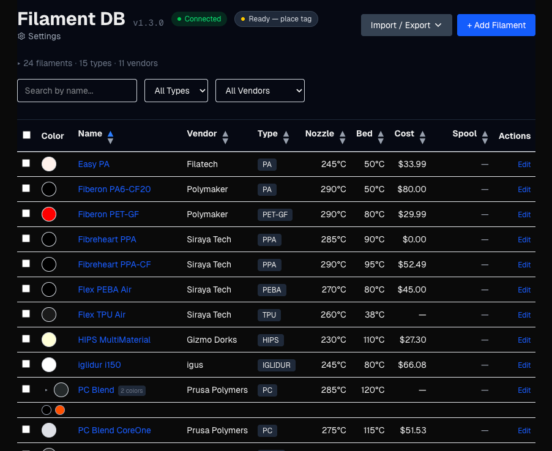

# Filament DB

A desktop and web application for managing 3D printing filament profiles. Import filament configurations from PrusaSlicer, store them in MongoDB or MongoDB Atlas, and manage them through a clean interface. Available as an installable desktop app for macOS, Windows, and Linux, or run as a local web app. The desktop app supports offline mode with an embedded local database, hybrid mode with automatic cloud sync, or direct Atlas cloud mode. The API is unauthenticated and intended for single-user localhost use; do not expose to untrusted networks without adding an auth layer.



## Features

### Filament Management
- **Browse and search** -- filterable, sortable table with color swatches and collapsible statistics (by type, vendor, color)
- **Full CRUD** -- create, view, edit, and delete filament profiles with temperatures, fan settings, shrinkage, retraction, pressure advance, abrasive/soluble flags, and notes
- **Material properties** -- glass transition temperature (Tg), heat deflection temperature (HDT), shore hardness (A/D), nozzle temp ranges, print speed ranges, per-bed-type temperatures
- **Slicer parity** -- OrcaSlicer/BambuStudio/PrusaSlicer settings: overhang fan, aux fan, layer time thresholds, MMU/AMS params, start/end G-code, z-offset, air filtration
- **Color variants** -- clone a filament as a color variant; inherited settings resolve automatically from the parent
- **Presets** -- named parameter variants per filament (e.g., shore hardness profiles with different temps and extrusion multiplier)
- **Spool tracking** -- track multiple spools per filament with individual weights, lot numbers, purchase/opened dates, and computed length from density and diameter
- **Technical Data Sheets** -- link vendor TDS documents with inline preview pane and auto-suggestions from same-vendor filaments
- **AI-powered TDS import** -- extract filament properties (temperatures, density, drying specs, Tg, HDT, shore hardness, speeds) from PDF or web TDS using Google Gemini, Anthropic Claude, or OpenAI ChatGPT
- **Material defaults backfill** -- script to populate Tg, HDT, density, drying params, and speed ranges from curated defaults for 30+ material types

### Hardware Integration
- **Printers** -- define printers with manufacturer, model, and installed nozzles
- **Nozzles** -- define nozzles by diameter, type, high-flow, and hardened attributes
- **Per-printer per-nozzle calibration** -- store EM, max volumetric speed, pressure advance, and retraction values per printer/nozzle combination
- **NFC tag read/write/erase** -- read, write, and erase [OpenPrintTag](https://openprinttag.io/) NFC-V (ISO 15693) tags using an ACR1552U reader (desktop app)
- **Instance IDs** -- unique per-filament identifier (5-byte hex, Prusament-compatible), written to NFC tags

### Import / Export
- **PrusaSlicer** -- import and export INI config bundles via browser upload or CLI
- **PrusaSlicer integration** -- live sync of filament presets to a [PrusaSlicer fork](https://github.com/hyiger/PrusaSlicer) via REST API; presets appear in the filament dropdown on startup with calibrated values baked in
- **OpenPrintTag database** -- browse the [OpenPrintTag community database](https://github.com/OpenPrintTag/openprinttag-database) (11,000+ materials from 97 brands), filter by type/brand/data quality, and selectively import filaments with completeness scoring
- **CSV / XLSX** -- import and export spreadsheets with column mapping
- **Prusament QR** -- scan a spool QR code or enter spool ID to auto-import specs, temps, weights, and pricing
- **Import from Atlas** -- connect to a remote MongoDB Atlas database and selectively import filaments
- **TDS extraction** -- paste a TDS URL to auto-populate the filament form via AI (Gemini, Claude, or ChatGPT)
- **OpenPrintTag binary** -- download `.bin` files with drying temps, transmission distance (HueForge TD), and instance ID
- **Snapshot backup/restore** -- export and import the entire database as JSON with atomic restore and rollback on failure

### Desktop App
- **Cross-platform** -- installable on macOS (.dmg), Windows (.exe), and Linux (.AppImage, .deb) including arm64 for Raspberry Pi
- **Offline mode** -- embedded local MongoDB; choose cloud-only, hybrid, or fully offline
- **Atlas sync** -- automatic bidirectional sync with MongoDB Atlas using last-write-wins conflict resolution

### Developer
- **REST API** -- full CRUD endpoints for filaments, nozzles, and printers
- **PrusaSlicer API** -- `GET /api/filaments/prusaslicer` exports filaments as a PrusaSlicer-compatible INI config bundle with calibration overrides; `POST` imports bundles back
- **API documentation** -- interactive Swagger UI at `/api-docs` with OpenAPI 3.0 spec

## Tech Stack

- [Electron](https://www.electronjs.org/) (desktop packaging)
- [Next.js](https://nextjs.org/) (App Router, TypeScript)
- [MongoDB Atlas](https://www.mongodb.com/atlas) (cloud, optional) / embedded local MongoDB (offline/hybrid)
- [Mongoose](https://mongoosejs.com/) ODM
- [Tailwind CSS](https://tailwindcss.com/)
- [Vitest](https://vitest.dev/) (coverage enforced on `src/lib/` and `src/models/`)

## Quick Start

### Desktop App (recommended)

Download the latest release for your platform from [GitHub Releases](https://github.com/hyiger/filament-db/releases). On first launch, the app will prompt you to choose a connection mode (cloud, hybrid, or offline). No MongoDB Atlas account is needed for offline mode.

### Docker

```bash
docker run -p 3000:3000 -e MONGODB_URI="mongodb+srv://..." ghcr.io/hyiger/filament-db
```

Open http://localhost:3000. See the [Setup Guide](docs/setup.md#option-2-docker) for Docker Compose and configuration options.

### From Source

```bash
git clone https://github.com/hyiger/filament-db.git
cd filament-db
npm install
cp .env.example .env.local   # then edit with your MongoDB Atlas connection string
npm run dev                   # web app at http://localhost:3000
npm run electron:dev          # or run as desktop app
```

See the [Setup Guide](docs/setup.md) for detailed instructions.

## Documentation

| Document | Description |
|----------|-------------|
| [Tutorial](docs/tutorial.md) | Step-by-step walkthrough of every feature, from first launch to NFC |
| [Setup Guide](docs/setup.md) | Installation, Docker, MongoDB Atlas setup, running as web or desktop app |
| [Desktop App](docs/desktop.md) | Electron desktop app: building, packaging, and releasing |
| [Importing & Exporting](docs/importing.md) | PrusaSlicer config export, web UI import, CLI seed script, INI export |
| [Usage Guide](docs/usage.md) | Browsing, filtering, sorting, editing filaments, nozzle management, calibrations, TDS links |
| [NFC Tags](docs/nfc.md) | Reading and writing OpenPrintTag NFC tags with the ACR1552U reader |
| [API Reference](docs/api.md) | REST API endpoints for filaments, nozzles, and printers (also available as [interactive Swagger UI](/api-docs)) |
| [Testing](docs/testing.md) | Running tests, coverage thresholds, CI/CD with GitHub Actions |
| [Troubleshooting](docs/troubleshooting.md) | Common errors and solutions |

## Project Structure

```
filament-db/
├── docs/                    # Documentation (setup, usage, API, desktop, testing, troubleshooting)
├── electron/                # Electron main process + preload (bundled by esbuild)
├── scripts/                 # CLI tools (seed import, icon generator, filament merge)
├── src/
│   ├── app/
│   │   ├── api/filaments/   # Filament REST API (CRUD, import, export, match, types, vendors, parents)
│   │   ├── api/nozzles/     # Nozzle REST API (CRUD)
│   │   ├── api/printers/    # Printer REST API (CRUD)
│   │   ├── api/prusament/    # Prusament spool scraping and import
│   │   ├── api/openprinttag/ # OpenPrintTag database browser and import
│   │   ├── api/tds/          # AI-powered TDS extraction (Gemini/Claude/OpenAI)
│   │   ├── api/setup/       # Connection test endpoint (for desktop setup wizard)
│   │   ├── api-docs/        # Interactive Swagger UI (OpenAPI 3.0)
│   │   ├── setup/           # First-launch setup wizard
│   │   ├── filaments/       # Filament pages (list, detail, edit, new)
│   │   ├── openprinttag/    # OpenPrintTag community database browser
│   │   ├── nozzles/         # Nozzle pages (list, edit, new)
│   │   └── printers/        # Printer pages (list, edit, new)
│   ├── components/          # React components (NFC status, dialogs, providers)
│   ├── hooks/               # Custom hooks (useNfc, useCurrency)
│   ├── lib/                 # DB connection, INI parser, OpenPrintTag encoder/decoder, TDS extractor, PrusaSlicer bundle generator, OpenPrintTag DB browser
│   └── models/              # Mongoose schemas (Filament, Nozzle, Printer)
├── tests/                   # Vitest unit tests (401 tests across 17 files)
├── .github/workflows/
│   ├── test.yml             # CI: tests on push/PR (Node 20 & 22)
│   ├── release.yml          # CD: build desktop installers on version tags (4 platforms)
│   └── docker.yml           # CD: build and push Docker image to GHCR on version tags
├── electron-builder.yml     # Electron packaging config (macOS, Windows, Linux x64/arm64)
└── vitest.config.ts         # Test config with coverage thresholds
```

## License

MIT
